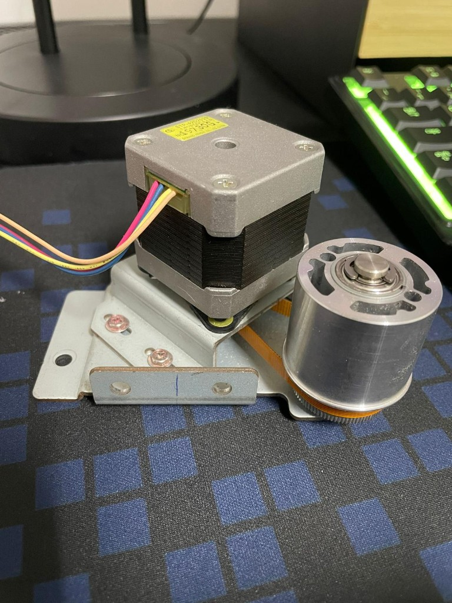

# Mecânica — Elevador

Partes mecânicas da maquete: estrutura, cabine, transmissão e fixações.

## Decisão de construção

> **Nota (junho 2026):** A estrutura mecânica **não foi impressa em 3D**. Foi construída **à mão com madeira**, e a cabine resulta de um **recipiente adaptado** à escala da maquete.  
> O plano inicial previa STL/impressão 3D — ver pasta [stl/](stl/) apenas como referência histórica.

## Subsistemas

| Elemento | Descrição | Estado |
|----------|-----------|--------|
| Shaft / poço | Estrutura dos 4 pisos em **madeira** | Montado |
| Cabine | **Recipiente adaptado** (não 3D) | Montado |
| Fixações I/O | Botões, LEDs, OLEDs na estrutura | Montado |
| Guias de cabos | **Argolas** brancas (tipo berço) + braçadeiras | Montado — [foto](../../maquete/imagens/fotos/2026-06-22_guias_cabos_argolas.png) |
| Motor + transmissão | NEMA 17 + **correia dentada** + **tambor (polia)** | Conjunto montado; **por integrar** no shaft |
| Cabo de aço | Cabine ↔ tambor | Pendente na maquete |
| Sensores Hall A3144 | Fixação por piso | Próximo passo |

## Transmissão motor → cabine

```text
NEMA 17 ── correia dentada ── tambor (polia)
                                  │
                              cabo de aço
                                  │
                               cabine
```

- Motor **bipolar 4 fios** (ex.: amarelo, rosa, azul, laranja no conector).
- Tambor funciona como **polia** de enrolamento.
- Motor testado com L298N e fonte **12 V na bancada** — integração física no shaft ainda não feita.



## Materiais

| Material | Uso |
|----------|-----|
| Madeira | Shaft, prateleiras/pisos, suportes |
| Recipiente adaptado | Corpo da cabine |
| Argolas metálicas | Guias de cablagem ao longo do shaft |
| Cabo de aço + tambor | Movimento vertical |
| Correia dentada | Motor → tambor |

## Dimensionamento motor

Ver [docs/relatorios/Dimensionamentos_motor.docx](../../../docs/relatorios/Dimensionamentos_motor.docx)

## Evidências

| Tipo | Local |
|------|-------|
| Motor + tambor | [imagens/2026-06-22_motor_nema17_tambor_correia.png](imagens/2026-06-22_motor_nema17_tambor_correia.png) |
| Guias cabos | [maquete/imagens/fotos/](../../maquete/imagens/fotos/) |
| Vídeos montagem | [maquete/imagens/videos/](../../maquete/imagens/videos/) |
| Estado actual | [maquete/ESTADO_ATUAL.md](../../maquete/ESTADO_ATUAL.md) |

## Etapa

[E08 — Montagem maquete](../../../docs/ETAPAS/relatorios/E08_montagem_maquete.md)
